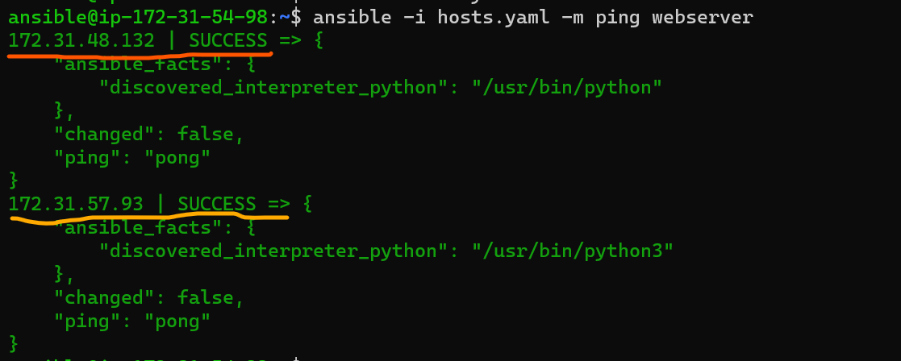
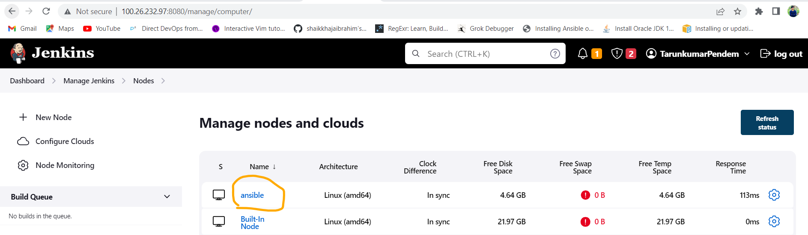

## Integrating Ansible from Jenkins:
------------------------------------
### Deploying Lampstack using Ansible in Ubuntu 20.04 and Centos7 from Jenkins:
-----------------------------------------------------------------------------
* Create an Ubbuntu and Centos7 node and configure them with ansible master/ansible control node(The server where we install ansible) and then configure the ansible control node in Jenkins to integrate the playbook from Jenkins.


* Write an ansible playbook for installing Wildfly
```yaml
---
--- 
- name: Installing php.info
  hosts: all 
  become: yes
  vars:
    php_file_path: ./info.php
    php_file_destination: /var/www/html/info.php
    when:
    - ansible_facts["distribution"] != "Ubuntu"
    - ansible_facts["distribution"] != "CentOs"
    - name: Error message
      ansible.builtin.fail:
        msg: This playbook only works for ubuntu & centos Operating Systems only try to run on those O.S's only..  
  tasks:
    - name: using debug
      ansible.builtin.debug:
        msg: Updating ubuntu packages and Installing apache2/httpd
    - name: updating the packages and installing apache2/httpd
      ansible.builtin.package:
        name: 
          - "{{ package_name_1 }}"
          - "{{ package_name_2 }}" 
        state: present
    - name: using debug
      ansible.builtin.debug:
        msg: copying info.php to node 
    - name: copying info.php file
      ansible.builtin.copy:
        src: "{{ php_file_path }}" 
        dest: "{{ php_file_destination }}"     
    - name: using debug
      ansible.builtin.debug:
        msg: starting the apache2 service 
    - name: start apache2 service
      ansible.builtin.service:
        name: apache2
        state: started
        enabled: yes
      when:
        - ansible_facts["distribution"] == "Ubuntu"   
    - name: using debug
      ansible.builtin.debug:
        msg: starting the httpd service
    - name: start httpd service
      ansible.builtin.service:
        name: httpd
        state: started
        enabled: yes 
      when:
        - ansible_facts["distribution"] != "Ubuntu"  
```
* Hosts file:
-------------
```yaml
all:
  children:
    webserver:
      hosts:
        # ubuntu
        172.31.57.93:
          package_name_1: apache2
          package_name_2: php
        # centos
        172.31.48.132:
          package_name_1: httpd
          package_name_2: php
```
* Then ping the nodes from Jenkins using Jenkinsfile
```groovy
pipeline{
    agent none
    stages{
        stage('clone'){
            agent{
                label 'ansible'
            }
            steps{
                git url: 'https://github.com/tarunkumarpendem/Documentations.git',
                    branch: 'main'
            }
        }
        stage('ansible-playbook'){
            agent{
                label 'ansible'
            }
            steps{
                sh """
                      cd Ansible-Jenkins-Integration/
                      ansible -i hosts.yaml -m ping webserver
                    """ 
            }
        }
    }
}
```

* Then run the playbook from Jenkinsfile
```groovy
pipeline{
    agent none
    stages{
        stage('clone'){
            agent{
                label 'ansible'
            }
            steps{
                git url: 'https://github.com/tarunkumarpendem/Documentations.git',
                    branch: 'main'
            }
        }
        stage('ansible-playbook'){
            agent{
                label 'ansible'
            }
            steps{
                sh """
                      cd Ansible-Jenkins-Integration/
                      ansible -i hosts.yaml -m ping webserver
                      ansible-playbook -i hosts.yaml playbook.yaml
                    """ 
            }
        }
    }
}
```

* Then check in the browser


