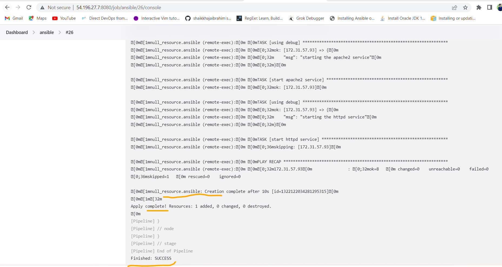
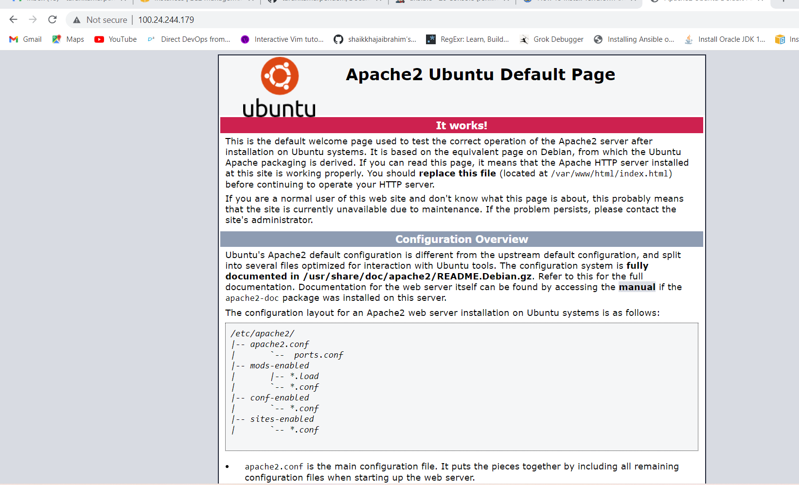

## Integrating Ansible from terraform:
--------------------------------------
* Create two instances and install ansible and terraform in one node.
* Configure node with ansible control node and add the node to Jenkins with necessary configuration required.
* Write the terraform files and Jenkinsfile to integrate ansible from terraform.
[Refre Here](https://github.com/tarunkumarpendem/Documentations/blob/main/Terraform-Ansible-Integration/main.tf) for `main.tf` file
[Refer Here](https://github.com/tarunkumarpendem/Documentations/blob/main/Terraform-Ansible-Integration/inputs.tf) for `inputs.tf` file
[Refer Here](https://github.com/tarunkumarpendem/Documentations/blob/main/Terraform-Ansible-Integration/provider.tf) for `provider.tf` file
[Refer Here](https://github.com/tarunkumarpendem/Documentations/blob/main/Terraform-Ansible-Integration/dev.tfvars) for variables declared file `dev.tfvars`.
[Refre Here](https://github.com/tarunkumarpendem/Documentations/blob/main/Terraform-Ansible-Integration/Jenkinsfile) for the Jenkinsfile which can call ansible from terraform template.

* Hostsfile for ansible
```yaml
all:
  children:
    webserver:
      hosts:
        # ubuntu
        172.31.57.93:
          package_name_1: apache2
          package_name_2: php
```

### Playbook which will install apache2 and info.php:
-----------------------------------------------------
* info.php
```php
<?php
phpinfo( );
?>
```

* Playbook
```yaml
--- 
- name: Installing php.info
  hosts: all 
  become: yes
  vars:
    php_file_path: ./info.php
    php_file_destination: /var/www/html/info.php
    when:
    - ansible_facts["distribution"] != "Ubuntu"
    - ansible_facts["distribution"] != "CentOs"
    - name: Error message
      ansible.builtin.fail:
        msg: This playbook only works for ubuntu & centos Operating Systems only try to run on those O.S's only..  
  tasks:
    - name: using debug
      ansible.builtin.debug:
        msg: Updating ubuntu packages and Installing apache2/httpd
    - name: updating the packages and installing apache2/httpd
      ansible.builtin.package:
        name: 
          - "{{ package_name_1 }}"
          - "{{ package_name_2 }}" 
        state: present
    - name: using debug
      ansible.builtin.debug:
        msg: copying info.php to node 
    - name: copying info.php file
      ansible.builtin.copy:
        src: "{{ php_file_path }}" 
        dest: "{{ php_file_destination }}"     
    - name: using debug
      ansible.builtin.debug:
        msg: starting the apache2 service 
    - name: start apache2 service
      ansible.builtin.service:
        name: apache2
        state: started
        enabled: yes
      when:
        - ansible_facts["distribution"] == "Ubuntu"   
    - name: using debug
      ansible.builtin.debug:
        msg: starting the httpd service
    - name: start httpd service
      ansible.builtin.service:
        name: httpd
        state: started
        enabled: yes 
      when:
        - ansible_facts["distribution"] != "Ubuntu"      
```

* Build the pipeline using Jenkinsfile

* verfiy in the browser wheather the application is in running condition or not using the public-ip of the node. 


